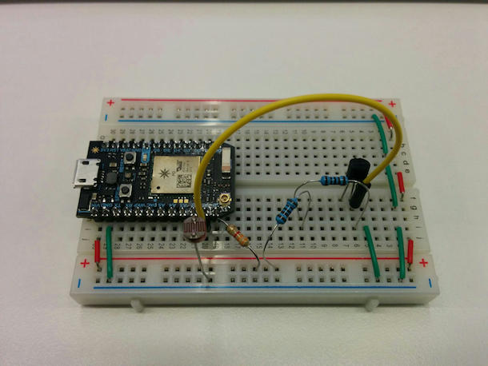

# EnvMon
Monitor your environment temperature and light using a Particle Photon and display it on web.

## Run

### Web dashboard

First, edit `particle-login.json` at the root of the project with your `Particle Cloud credentials` or your `accessToken`:

```json
{ "username": "user@email.com", "password": "pass" }
```

```json
{ "accessToken": "ACCESS_TOKEN" }
```

Then you are ready to run the project:

```shell
npm install
gulp
open http://localhost:12345
```

## Web dashboard

### Temperature
Displayed in Celsius and Fahrenheit with a spark line to show the trend:


### Light
The background color vary according to the light sensor value, becoming darker or lighter.

## Electronics



Components:
* Particle [Photon](https://store.particle.io/collections/photon) (should work with a Spark Core as well)
* CdS photoresistor
* Temperature sensor LM35DZ
* Resistors: 2k Ohm + 3.3k Ohm
